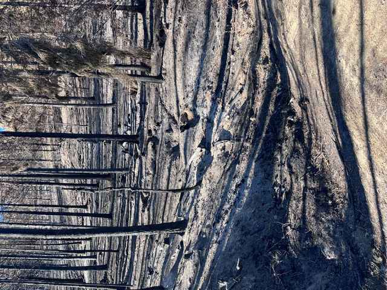
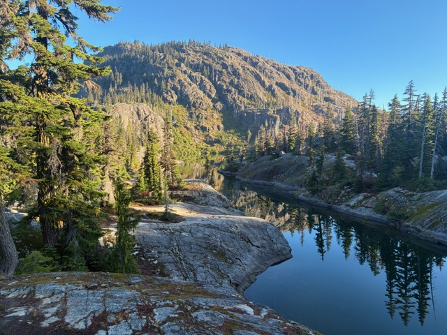
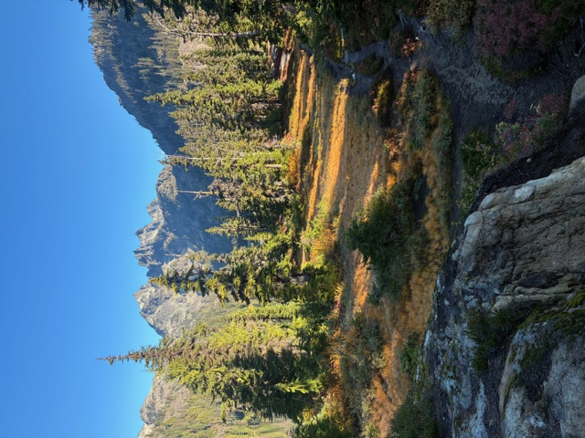

```{=html}
<div class="section">
<p class="section-title">Field Notes</p>

<p><em>Observations, figures in progress, and remote sensing outputs from the field. 
Updated as the dissertation develops.</em></p>

<hr>

<div class="card-grid">

<div class="card">
  
  <div class="card-body">
    <span class="card-tag">Labor Mountain · 2024</span>
    <h3>Post-Fire Surface Erosion</h3>
    <p>Rill networks developing on burned hillslopes at the Labor Mountain site. 
    Hydrophobic soils and complete canopy removal driving rapid surface runoff 
    response even in minor precipitation events.</p>
  </div>
</div>

<div class="card">
  
  <div class="card-body">
    <span class="card-tag">Labor Mountain · 2024</span>
    <h3>Canopy Loss & Light Penetration</h3>
    <p>Complete stand-replacing fire across the Labor Mountain perimeter. 
    The absence of canopy interception is the primary variable driving 
    changes in snowpack energy balance — the core question of Paper 1.</p>
  </div>
</div>

<div class="card">
  
  <div class="card-body">
    <span class="card-tag">Eastern Cascades</span>
    <h3>Study Region</h3>
    <p>The Eastern Cascades present a rain-snow transition zone where 
    mid-elevation snowpacks are particularly vulnerable to atmospheric 
    river-driven rain-on-snow events. Field sites sit at 1,200–1,800m elevation.</p>
  </div>
</div>

<div class="card">
  
  <div class="card-body">
    <span class="card-tag">Eastern Cascades</span>
    <h3>Watershed Landscape</h3>
    <p>Mixed conifer forest across the Peshastin and Tillicum Creek watersheds. 
    Pre-fire canopy cover data from RAVG CC-5 product provides the baseline 
    for measuring post-fire change.</p>
  </div>
</div>

</div>

<hr>

<p style="color: #888; font-size: 0.85rem;"><em>More figures and outputs will be added as GEE analysis and field campaigns progress through 2025–2026.</em></p>

</div>
```
