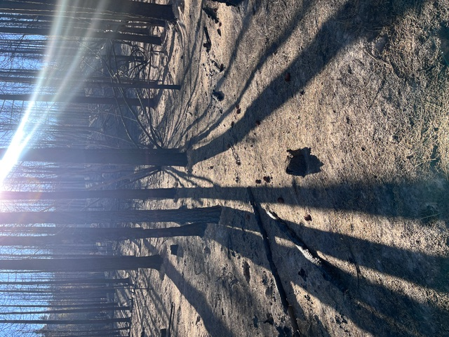
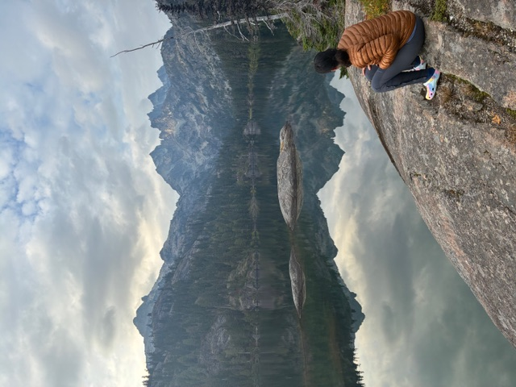

```{=html}
<!-- HERO -->
<div class="hero">
  
  <div class="hero-content">
    <h1>Karenth Dworsky 🔥❄️</h1>
    <p class="subtitle">Watershed Scientist &nbsp;·&nbsp; Federal Hydrologist &nbsp;·&nbsp; PhD Candidate</p>
    <p class="tagline">Studying what fire leaves behind — and what snow does next.</p>
  </div>
</div>

<!-- ABOUT -->
<div class="section">
  <p class="section-title">About</p>
  <div class="about-grid">
    
    <div>
      <p>
        I'm a watershed scientist and federal hydrologist working at the intersection of 
        post-fire hydrology, remote sensing, and western water law. I grew up in Alaska 
        and have spent my career chasing water across the West — from Arctic drainages 
        to desert arroyos to the fire-scarred forests of the Eastern Cascades.
      </p>
      <p>
        I currently serve as a GS-12 Watershed Project Manager, BAER Coordinator, and 
        Water Rights Program Manager at the USDA Forest Service's Okanogan-Wenatchee 
        National Forest, and am completing my PhD in Watershed Science at Colorado State 
        University under Dr. Steven Fassnacht.
      </p>
      <p>
        When I'm not in the field or staring at snow data, I'm trail running mountain 
        routes out of Wenatchee or baking sourdough in Steamboat Springs.
      </p>
      <div class="badge-row">
        
        
        
        
        
      </div>
    </div>
  </div>
</div>

<!-- RESEARCH SNAPSHOT -->
<div class="section">
  <p class="section-title">Research</p>
  <p>
    My dissertation examines how wildfire-driven canopy loss alters snowpack dynamics 
    and streamflow response during rain-on-snow events in the Eastern Cascades — a 
    critical and understudied flood hazard in the Pacific Northwest interior.
  </p>
  <p><a href="research.html" style="color: #7ab3cc;">→ Read more about the dissertation</a></p>
</div>

<!-- FIELD NOTES SNAPSHOT -->
<div class="section">
  <p class="section-title">Latest Field Notes</p>
  <p style="color: #888; font-size: 0.9rem;">
    Field observations, figures in progress, and remote sensing outputs from the 
    Labor Mountain and Lower Sugarloaf fire sites.
  </p>
  <p><a href="fieldnotes.html" style="color: #7ab3cc;">→ View field notes</a></p>
</div>
```
